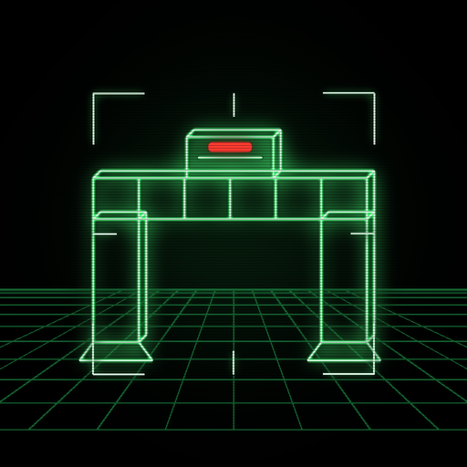

# X3Paranoids



A first-person vector tank in a maze of light, hunting Recognizers — a 1982 arcade-cabinet homage
for the RayNeo X3 Pro glasses. Your **head is the periscope**, the temple pad is the hull, a tap
is the cannon. Green phosphor wireframes on black, a stroke-font HUD, a robotic system voice, and
the IO Tower cover looping underneath.

> Contains flashing lights (damage flashes, lock-on warnings, muzzle flare). Stop if you feel unwell.

Kotlin + OpenGL ES 3, zero dependencies, zero permissions, no network. Package `com.x3paranoids`.

## How it plays

- **Look around by moving your head.** The game-rotation sensor drives the periscope; the maze
  stays world-locked. Triple-tap re-centres "forward" on wherever you're looking.
- **Swipe up / down** on the right temple pad = drive forward / backward (one impulse per swipe;
  chain them to keep rolling). **Swipe left / right** = shift the hull sideways. All movement is
  relative to where you look.
- **Tap** = fire. Shells fly where the sight points and ricochet off walls.
- **Recognizers** patrol the corridors in green. When one sees you it turns **red**, stands off,
  circles, and fires — the HUD brackets pulse and the voice warns you. Ram damage counts too.
- **The Bit** hides somewhere in the maze every wave (*FIND THE BIT*): touching it is +500 and an
  extra life (max 5). It chatters yes/no while you look for it.
- Clear every Recognizer to clear the wave; every third wave the maze regenerates. Later waves add
  Recognizers (up to 9), speed, fire rate and armour, and the walls drift from phosphor green
  toward white.
- 3 lives. Score, best wave and total games are remembered.

## Controls (right temple pad)

| Gesture | In play | In the settings menu |
|---|---|---|
| Tap | fire | adjust / toggle the selected row |
| Swipe up / down | drive forward / backward | move the selection |
| Swipe left / right | shift left / right (or turn, with Head Look off) | adjust the selected value |
| Double-tap | open / close settings (pauses) | close |
| Triple-tap | re-centre the head | — |

One swipe is one step; there is no long-press (the glasses reserve it for the system shade). The
left temple pad is the system volume pad and is ignored.

## Settings (double-tap)

Music · Volume · Voice · Head Look (Off = left/right swipes turn the hull instead) · Strafe
(Normal / Reversed — the pad's horizontal sign is a matter of taste) · Difficulty (Normal / Hard:
armoured Recognizers, faster patrols) · Reset Settings (confirm twice). Records are kept on reset.

## The voice

Every line the system speaks is pre-rendered by `tools/generate_voice.sh`: macOS's **Zarvox**
synthesiser voice pushed through a ring-modulator / echo / bit-crusher chain in ffmpeg, bundled as
36 small AAC clips in `app/src/main/assets/voice/` with a duration manifest. The title's lore crawl
reveals each line on the beat the voice starts it. "Monopoly Control Protocol" is this universe's
name for the villain.

## Music

`app/src/main/assets/music/io_tower.mp3` — the IO Tower cover shared with x3cycles, looping under
the title and the maze.

## Build and install

Requires JDK 17, the Android command-line tools (`sdk.dir` in `local.properties`) and the bundled
Gradle wrapper (Gradle 8.9 / AGP 8.7.3 / Kotlin 2.0.21; compileSdk 35, minSdk 29).

```sh
cd X3Paranoids
JAVA_HOME=$(/usr/libexec/java_home -v 17) ./gradlew assembleDebug
adb install -r app/build/outputs/apk/debug/app-debug.apk
adb shell am start -n com.x3paranoids/.MainActivity
```

The app declares itself to the RayNeo launcher (`com.rayneo.mercury.app`, category
`com.rayneo.intent.category.AR_APP`) and renders a 1280×480 side-by-side surface (the left eye is
the left 640 px of a screenshot). The launcher icon and `art/icon-512.png` are rendered by
`tools/make_icon.py`.

tropicalstream · no network, no permissions.
